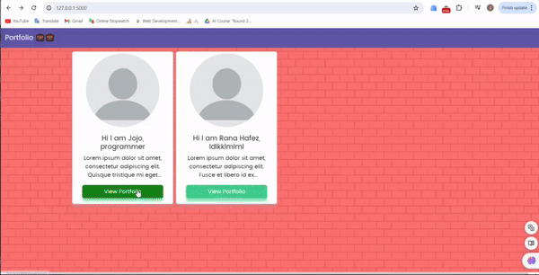
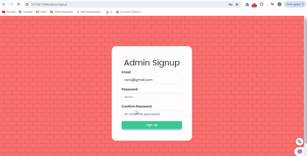
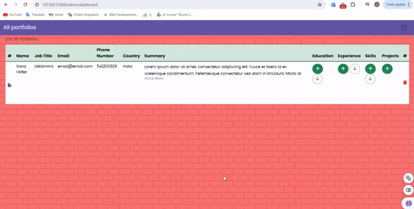

# Project 1 - Portfolio Maker Website

## Welcome! 👋

Thanks for checking out this coding project.

First gig I did on upwork. A school project to create a website for allowing admin to create portfolios for users and the visitors can view all the portfolios

## Table of contents

- [Overview](#overview)
  - [The challenge](#the-challenge)
  - [Screenshot](#screenshot)
  - [Links](#links)
- [My process](#my-process)
  - [Built with](#built-with)
  - [What I learned](#what-i-learned)
  - [Continued development](#continued-development)
  - [Useful resources](#useful-resources)
- [Author](#author)
- [Acknowledgments](#acknowledgments)


## Overview

This is a project where there is 2 users of the website. The main user is the admin in which he has to 
* login and signup on the website.
* create user portfolios
* perform CRUD operations on the portfolio
* logout of the user 

The other user is the viewers of the website where they can:
* view the portfolios created.

### Functional requirements:
* Homepage: A general presentation of the portfolio.
* User Information Section: Display personal information such as name, job title, and contact details.
* Education Section: List degrees, certifications, and courses taken.
* Skills Section: Showcase technical and personal skills.
* Professional Experience Section: Detail previous jobs and internships.
* Projects Section: Provide descriptions of completed projects, specifying whether they are professional or school projects.
* Admin Interface: Secure login access to manage the content.
* Add Information: Ability to add new entries in each section.
* Modify Information: Ability to edit existing entries.
* Delete Information: Ability to remove entries.
* Database Management: Use SQLAlchemy for managing and storing portfolio information.
* Form-Based Input: User-guided forms for inputting and updating data in the database.
* Progress Updates: Send photos or videos of the interface during development for feedback.
* Error-Free Operation: Ensure the site operates without errors and meets the specified requirements.

### Non-functional requirements: 
* Simple: The design should be straightforward and easy to navigate.
* Secure: The admin interface must have secure access through authentication.
* Reliable: The website must work without errors and be available when needed.
* Maintainable: The code should be well-structured and documented for future maintenance.
* Responsive: The site should be accessible and functional on various devices and screen sizes
### Screenshot


#### main page


#### login-signup admin page


#### admin panel 


## My process

### Built with

- Semantic HTML5 markup
- CSS custom properties
- Flexbox
- Bootstrap
- JQuery
- Python Flask
- SQLAlchemy

### What I learned

I learnt alot doing this project. 
Especially on How to create the database so that I can delete a skill for example and not delete all the whole user.
this is done using cascade="all, delete-orphan"
```python
class Users(db.Model):
    __tablename__ = "users"
    id: Mapped[int] = mapped_column(primary_key=True)
    name: Mapped[str] = mapped_column(String(255))
    
    educations: Mapped[List["Education"]] = relationship(back_populates="user", cascade="all, delete-orphan")
    experiences: Mapped[List["Experience"]] = relationship(back_populates="user", cascade="all, delete-orphan")
    skills: Mapped[List["Skills"]] = relationship(back_populates="user", cascade="all, delete-orphan")
    projects: Mapped[List["Projects"]] = relationship(back_populates="user", cascade="all, delete-orphan")
```

Also How to add a tool or achievement to the project form, and this is done using a mix of Flask-Forms, JQuery ,and Bootstrap.
### Continued development

I would like to add in the future:
* Multi-Step form to create the user for the first time.

### Useful resources

- [SqlAlchemy Cascades Documentation](https://docs.sqlalchemy.org/en/20/orm/cascades.html) - This helped me for getting the db relations to work.
- [Front-end mentors Challenge - Intro component with sign-up form](https://www.frontendmentor.io/challenges/intro-component-with-signup-form-5cf91bd49edda32581d28fd1) - I have trouble in choosing the colors and the fonts so this design helped me so much.
- [Hero Patterns](https://heropatterns.com/) - Used the background image for it.


## Author

- My Portfolio - [My Portfolio](https://portofolio-8jzk.onrender.com/)
- Frontend Mentor - [@RanaHafez](https://www.frontendmentor.io/profile/RanaHafez)
- Linkedin - [Rana Hafez](https://www.linkedin.com/in/rana-hafez-a34315227/)

## Acknowledgments

I would like to express my gratitude to the client for giving me the opportunity to work on this project. Your collaboration and feedback were invaluable in creating a successful web portfolio. Thank you for your trust and support.

# Rana Hafez (2024)